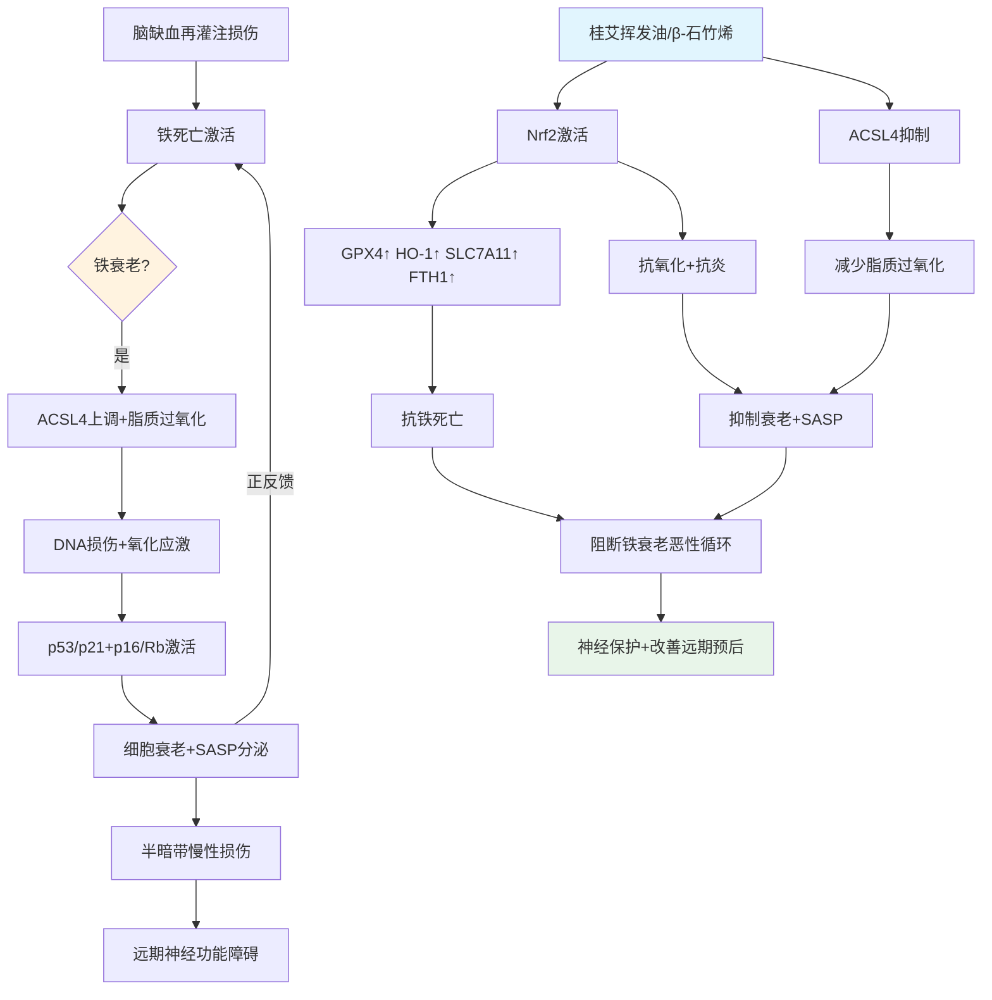

# 广西道地壮药桂艾（β-石竹烯）通过铁死亡驱动的细胞衰老（铁衰老）干预脑缺血再灌注损伤的机制研究

---

## （一）立项依据与研究内容

### 1. 项目的立项依据

#### （1）国内外研究进展

##### 1）现代医学对脑缺血再灌注损伤的认识

脑缺血再灌注损伤（cerebral ischemia/reperfusion injury, CIRI）是指缺血脑组织恢复血流灌注后，损伤反而进一步加重的病理现象。急性缺血性脑卒中（acute ischemic stroke, AIS）是我国成年人致死、致残的首位病因，具有高发病率、高致残率、高死亡率和高复发率的特点。据《中国卒中报告2023》数据显示，我国卒中患病率为1114.8/10万，发病率为246.8/10万，死亡率为114.8/10万，给家庭和社会带来沉重负担。

目前，静脉注射重组组织型纤溶酶原激活剂（recombinant tissue plasminogen activator, rt-PA）和替奈普酶（tenecteplase, TNK）是获美国FDA批准的急性缺血性脑卒中药物治疗手段，血管内机械取栓也是大血管闭塞的标准治疗方案。然而，rt-PA/TNK的标准治疗时间窗仅为发病后4.5小时，极为狭窄，且伴有出血性转化风险；即便成功实现血管再通，相当一部分患者仍出现"无复流"现象或再灌注损伤，预后不佳。因此，深入揭示CIRI病理机制并寻找新的神经保护靶点与药物，具有重要的临床意义和社会价值。

###### ①经典损伤机制

CIRI的病理机制复杂，涉及多个相互交织的级联反应。经典损伤机制主要包括以下三方面：第一，兴奋性氨基酸毒性。缺血导致谷氨酸大量释放，过度激活N-甲基-D-天冬氨酸（NMDA）受体，引起钙离子内流和神经元兴奋性损伤，是缺血早期神经元损伤的主要机制。第二，钙超载。细胞内钙离子浓度异常升高，激活钙依赖性酶类，导致细胞骨架降解和膜结构破坏，并触发线粒体功能障碍，促进活性氧（ROS）产生和细胞死亡。第三，氧化应激。再灌注期间氧供恢复，线粒体电子传递链产生大量ROS，超出内源性抗氧化系统的清除能力，引发脂质过氧化、蛋白质氧化和DNA损伤。上述经典机制相互关联，共同构成CIRI的病理基础。

###### ②新型损伤机制

近年来，研究先后证实坏死性凋亡、铁死亡、铜死亡等多种新型程序性死亡方式参与CIRI进程。坏死性凋亡由受体相互作用蛋白激酶（RIPK）介导，具有坏死样形态学特征但受信号分子调控，其关键效应分子为MLKL蛋白。铁死亡则是一种铁依赖性脂质过氧化驱动的细胞死亡方式，与谷胱甘肽过氧化物酶4（GPX4）失活和脂质ROS积累密切相关[Dixon等, 2012]。2022年，Tsvetkov等报道了一种全新的铜依赖性程序性死亡方式——铜死亡，为CIRI研究开辟了新方向。其中，铁死亡因其与铁代谢、氧化应激的固有联系，在CIRI中尤为引人关注。

大量研究证实铁死亡是CIRI后神经元死亡的关键方式之一。在MCAO/R模型中，缺血再灌注后铁死亡标志物（如ACSL4、PTGS2、4-HNE）呈时间依赖性上调，而GPX4、SLC7A11等抗铁死亡蛋白表达下降，同时伴随铁离子蓄积和脂质过氧化增强[Hu等, 2022]。铁死亡抑制剂（如Ferrostatin-1、Liproxstatin-1、去铁胺）可显著减小梗死体积、改善神经功能缺损，进一步证实铁死亡在CIRI中的重要作用。

###### ③CIRI与细胞衰老

细胞衰老（cellular senescence）是指细胞在遭受应激损伤后进入的一种永久性细胞周期停滞状态，伴随衰老相关分泌表型（senescence-associated secretory phenotype, SASP）的分泌。传统观点认为，衰老主要与机体老化相关，但近年研究发现，急性损伤后细胞也可发生应激诱导的早熟性衰老（stress-induced premature senescence, SIPS）。

在CIRI领域，越来越多的证据表明细胞衰老参与了缺血后脑损伤的病理进程。Baixauli-Martín等[2025]对实验性缺血性卒中的细胞衰老标志物进行了系统的时空表征，发现在小鼠MCAO模型中，缺血半暗带区域的神经元、星形胶质细胞和小胶质细胞均出现衰老标志物（p16INK4a、p21CIP1、SA-β-gal）的上调，且衰老细胞的出现与神经功能缺损的严重程度相关。SASP因子（如IL-6、TNF-α、MMP-3、CXCL10）在缺血后持续释放，形成慢性炎症微环境，阻碍神经发生和突触重塑，影响远期功能恢复。

然而，目前关于CIRI中细胞衰老的启动机制尚不完全清楚。缺血再灌注过程中产生的大量ROS、DNA损伤、铁代谢紊乱等因素，均可能是诱导细胞衰老的上游驱动因素。其中，铁死亡与细胞衰老之间是否存在因果关联，铁死亡是否作为上游驱动因子诱发细胞衰老，进而形成"铁死亡-衰老"恶性循环，是本项目拟重点探讨的科学问题。

##### 2）铁衰老概述及其在CIRI中的病理意义

###### ①铁衰老概述

铁死亡与细胞衰老并非两个孤立的病理过程。近年研究揭示，二者之间存在密切的交互作用，共同构成一个"铁死亡驱动细胞衰老"的新型病理轴——即"铁衰老"（ferro-senescence）。

2026年，Liu等[Cell Metabolism, 2026]在灵长类动物研究中首次系统定义了"ferro-aging"这一概念：铁过载通过ACSL4介导的脂质过氧化，驱动细胞进入衰老状态，形成一个从铁代谢紊乱到脂质过氧化再到细胞衰老的完整级联反应。该研究在多种人类细胞衰老模型（复制性衰老、HGPS、Werner综合征）以及自然衰老的人和非人灵长类组织中，均观察到铁离子（Fe²⁺）的显著蓄积，同时伴随ACSL4、COX2等脂质过氧化关键酶的上调和MDA、4-HNE等脂质过氧化终产物的增加。功能实验证实，铁过载可直接诱导人间充质干细胞、肝细胞和神经元发生衰老，表现为SA-β-gal活性增加、p21上调、Lamin B1丢失等典型衰老表型；而敲低ACSL4则可逆转铁过载诱导的衰老表型。

铁衰老的核心机制可概括为：亚致死剂量的铁死亡刺激（如低剂量铁离子、轻度脂质过氧化）不足以直接导致细胞死亡，但通过持续的铁依赖性氧化应激，引发DNA损伤响应（DDR，如γH2AX焦点形成），激活p53/p21CIP1和p16INK4a/Rb通路，诱导细胞进入早熟性衰老状态。其典型特征是：细胞呈现衰老标志（SA-β-gal阳性，p21/p16上调，SASP分泌），同时伴有铁蓄积、脂质过氧化水平升高，但细胞并未发生典型的坏死或凋亡。

铁衰老的关键分子连接枢纽包括：

**ACSL4**：作为铁衰老的核心执行者，ACSL4催化长链多不饱和脂肪酸（尤其是花生四烯酸和肾上腺酸）酯化为酰基辅酶A衍生物，随后整合入磷脂，使细胞膜对铁驱动的过氧化高度易感。Liu等[2026]的研究表明，ACSL4过表达足以加速细胞衰老，而ACSL4敲低则可逆转铁过载诱导的衰老表型。肝脏靶向ACSL4基因编辑可改善自然衰老小鼠和早衰小鼠的多器官功能，证实ACSL4是铁衰老的可干预靶点。

**Nrf2/ARE通路**：Nrf2是细胞氧化应激反应的核心转录因子，既调控铁死亡防御（上调GPX4、FTH1、SLC7A11等），又是抑制细胞衰老和SASP的关键调控者。Nrf2活性随衰老下降，使细胞抗氧化能力减弱，铁死亡敏感性增加，同时衰老进程加速。VC等Nrf2激活剂可通过激活Nrf2增强内源性抗氧化防御，协同抑制铁衰老[Liu等, 2026]。

**HMGB1/铁自噬环路**：铁死亡释放的HMGB1可结合TLR4，激活NF-κB，驱动SASP形成。同时，SASP中的IL-6、TNF-α可上调转铁蛋白受体（TFR1），加剧铁摄取，形成"铁死亡→SASP→铁摄取增加→更多铁死亡"的恶性循环。

此外，铁死亡与衰老共享多个特征性病理改变，包括DNA损伤、氧化还原稳态失衡、线粒体功能障碍、铁代谢异常、脂质代谢紊乱、慢性炎症等[管文斌等, 2023]。这些共性进一步支持二者之间存在机制上的连续性和因果性。

###### ②铁衰老在CIRI中的病理意义

基于上述研究进展，我们提出CIRI半暗带中存在"铁衰老"病理轴的假说：

在CIRI的缺血核心区，神经元遭受严重缺血缺氧，快速发生铁死亡和坏死；而在缺血半暗带（penumbra），神经细胞遭受"亚致死量"的铁死亡压力——再灌注带来的氧自由基、谷氨酸兴奋毒耗竭GSH、游离铁释放等因素共同构成轻度但持续的氧化应激和铁代谢紊乱，尚不足以立即触发细胞死亡，但足以驱动细胞进入"铁衰老"状态。

这些"铁衰老"细胞具有以下病理危害：

**第一，形成持久的衰老细胞灶，阻碍半暗带恢复。** 衰老细胞一旦形成，可长期存活并持续分泌SASP因子，形成有毒的微环境，抑制神经干细胞增殖分化、阻碍突触重塑、促进胶质瘢痕形成，使半暗带组织无法向正常组织转化，影响远期神经功能恢复。

**第二，SASP反推铁死亡，形成恶性循环。** SASP中的促炎因子（IL-6、TNF-α）可上调TFR1，增加铁摄取；同时炎症可诱导ACSL4表达，增强脂质过氧化，进一步促进周围细胞发生铁死亡或进入衰老状态，使损伤范围逐步扩大。

**第三，破坏神经血管单元完整性。** 半暗带中的衰老内皮细胞、星形胶质细胞可破坏血脑屏障完整性，增加血管源性脑水肿风险；衰老小胶质细胞则持续释放促炎因子，加重神经炎症。

目前，关于CIRI中铁衰老的研究尚处于起步阶段。尽管已有研究分别证实铁死亡和细胞衰老各自参与CIRI，但二者之间的因果关联——即铁死亡是否驱动细胞衰老、铁衰老在CIRI半暗带中是否真实存在、其时空分布规律如何——尚缺乏系统的实验证据。阐明这一问题，将为理解CIRI的慢性化机制提供全新视角，并为从"铁衰老"这一新靶点出发寻找神经保护策略奠定理论基础。

##### 3）桂艾与活性成分β-石竹烯：CIRI干预新策略

鉴于铁衰老涉及铁代谢异常、氧化应激、炎症及衰老信号等多重通路，理想的干预药物应具备多靶点协同作用。天然小分子化合物在此方面独具优势。艾草作为传统常用中药，在神经保护方面显示出潜力，尤其是壮药桂艾，其活性成分β-石竹烯（β-caryophyllene, BCP）含量显著高于其他种类的艾草，且已知具有抗炎、抗氧化、神经保护等活性，成为靶向铁衰老干预CIRI的极佳候选。

###### ①艾草与桂艾

艾草（Artemisia argyi H.Lév. & Vaniot）性温、味苦辛，具温经通络、散寒止痛之效，《本草纲目》记载其可"通十二经，具回阳、理气血、逐湿寒"之功（李时珍，2006）。在壮瑶医药理论中，艾草（壮语称"挨"，瑶语称"各艾"）为"通龙路火路、除风毒寒毒、逐湿邪"之要药，常用于麻痹、头痛等脑病的熏洗或内服治疗。其"解毒除蛊"功效正对应现代医学的清除自由基、抗炎、调节细胞死亡等作用。

红脚艾（Artemisia verlotorum），俗称桂艾，为岭南（广西）道地壮药。现代药理研究证实，艾草挥发油富含BCP、1,8-桉叶素、樟脑等多种活性成分，具有明确的抗炎、抗氧化及神经保护作用。针对广西产艾草挥发油成分的系统分析发现，桂艾中BCP相对含量可达18.21%（宋叶等，2019），显著高于普通艾草品种。Guo等[2023]通过GC-MS结合电子鼻技术对不同种质资源艾叶挥发油进行化学组成分析和鉴别，证实不同产地艾叶的挥发油组成存在显著差异，其中β-石竹烯是含量最高的倍半萜类成分之一。这一产地差异为桂艾在CIRI治疗中的应用提供了独特的物质基础。

Liu等[2021]在Journal of Ethnopharmacology发表的综述系统总结了艾叶挥发油的化学成分、药理作用和毒理学特征，指出其挥发油中已鉴定出超过200种成分，主要包括单萜类、倍半萜类及其氧化物，其中BCP是含量最高的倍半萜成分之一，且具有显著的抗炎、抗氧化、抗肿瘤和神经保护活性。

Zhang等[2023]报道艾叶挥发油可通过上调TFR1和耗竭γ-谷氨酰循环诱导胰腺癌细胞铁死亡，这从侧面说明艾叶挥发油可调控铁死亡通路，但其在正常组织/损伤组织中对铁死亡的调控方向（促进或抑制）可能取决于具体的病理状态和成分组成。

###### ②BCP药理性质

β-石竹烯（β-caryophyllene, BCP）是一种天然双环倍半萜烯，分子式为C₁₅H₂₄，广泛存在于多种植物挥发油中，如黑胡椒、丁香、大麻、迷迭香、啤酒花等[Sharma等, 2016]。Gertsch等[PNAS, 2008]发表的里程碑式研究首次证实，BCP为CB2受体选择性激动剂，对CB1受体无显著亲和力，无中枢精神活性，因此被归类为"膳食大麻素"（dietary cannabinoid）。BCP已被美国FDA和欧洲食品安全局批准为食品调味剂，具有良好的安全性。

BCP药理活性谱广泛：

**抗炎作用**：BCP通过激活CB2受体抑制脂多糖（LPS）诱导的TNF-α、IL-1β及IL-6等促炎因子释放，减轻炎症细胞浸润；同时可抑制NF-κB信号通路的激活，减少促炎基因转录。在脑缺血模型中，BCP通过抑制HMGB1-TLR4信号通路，显著降低缺血脑组织中TNF-α、IL-6等促炎因子水平[Yang等, 2017]。

**抗氧化作用**：BCP可直接清除自由基，增强超氧化物歧化酶（SOD）、谷胱甘肽过氧化物酶（GPx）等抗氧化酶活性。其抗氧化作用的核心机制之一是激活Nrf2/HO-1信号通路，上调下游抗氧化基因的表达[Hu等, 2022]。

**神经保护作用**：BCP为高脂溶性倍半萜烯（LogP≈4.5-4.7），分子量小（204.36 g/mol），具备被动扩散穿过血脑屏障（BBB）的理化基础。体内分布研究亦证实其可进入脑组织。多项研究表明，BCP可减小MCAO/R模型脑梗死体积、改善神经功能缺损评分、减轻认知障碍、保护白质结构完整性[Yang等, 2017; Bahi等, 2014]。

**抗凋亡与调控细胞死亡**：BCP可下调坏死性凋亡核心分子RIPK1、RIPK3的表达，并抑制MLKL磷酸化[Yang等, 2017]；同时可调节Bcl-2/Bax比值，减少神经元凋亡。近年研究进一步证实BCP可通过抑制铁死亡发挥组织保护作用。

###### ③BCP在CIRI中的神经保护效应及铁死亡调控证据

BCP在CIRI模型中展现出显著的神经保护效应，已有多个层面的证据支持：

**整体动物实验**：Yang等[2017]在小鼠MCAO模型中证实，BCP可显著减少脑梗死体积并改善神经功能缺损评分，其机制与抑制HMGB1-TLR4炎症通路和坏死性凋亡有关。Hu等[Phytomedicine, 2022]在大鼠MCAO/R模型中系统研究了BCP对铁死亡的调控作用，发现BCP（204、306、408 mg/kg，灌胃）可剂量依赖性地改善神经功能评分、减少脑梗死体积、减轻组织病理学损伤；分子机制上，BCP可促进Nrf2核转位，上调HO-1和GPX4的表达，下调ACSL4的表达，从而抑制铁死亡。Nrf2抑制剂ML385可逆转BCP的神经保护作用，证实BCP的抗铁死亡效应依赖于Nrf2/HO-1通路的激活。

**细胞实验**：在原代星形胶质细胞OGD/R模型中，BCP（10、20、40 μM）预处理可剂量依赖性地提高细胞活力，降低ROS产生和铁离子蓄积，上调GPX4、Nrf2、HO-1的表达，下调ACSL4的表达[Hu等, 2022]。李尤[2024]在HT1080和H9c2细胞中证实，BCP可抑制RSL3和IKE诱导的铁死亡，降低MDA和PTGS2 mRNA水平，恢复GSH/GSSG比值，保护线粒体结构和功能；其机制可能与BCP的ROS清除活性有关，而非通过直接上调GPX4、SLC7A11、FSP1等经典铁死亡通路蛋白的表达。

**网络药理学分析**：刘胜伟等[2024]通过网络药理学方法系统分析了BCP抗CIRI的潜在靶点和通路，筛选出194个BCP相关靶点、1144个CIRI相关靶点，交集靶点102个；PPI网络分析显示关键靶点包括IL-6、TNF、TP53、MAPK1、STAT3、CASP3等；KEGG富集分析显示主要涉及PPAR、MAPK、NF-κB、p53等信号通路，提示BCP通过抗炎、抗氧化、抗凋亡等多靶点、多通路发挥神经保护作用。体内验证实验证实，BCP可下调MCAO大鼠脑组织中TP53、CASP3、Mdm2蛋白的表达，验证了网络药理学的预测结果。

**其他模型中的证据**：BCP在心肌缺血再灌注、阿霉素心肌病、血管性痴呆等模型中也被证实具有抑制铁死亡的作用。在心肌缺血再灌注模型中，BCP通过激活自噬减轻心肌损伤；在血管性痴呆模型中，BCP通过抑制铁死亡改善认知功能。

尤为关键的是，BCP激活Nrf2/HO-1通路的能力从机制上为其抗铁衰老效应提供了合理解释，因为该通路既是调控GPX4表达和铁稳态的关键上游信号，又是抑制细胞衰老和SASP的核心防御机制。

###### ④科学问题的深化：从铁死亡到铁衰老的机制跃迁与桂艾的整体药效验证

尽管BCP抑制CIRI铁死亡已有明确证据，但以下三个关键问题仍未阐明，构成本项目的研究出发点：

**第一，BCP能否阻断铁死亡驱动的细胞衰老（即铁衰老），完全未知。** 如前所述，铁死亡与细胞衰老在CIRI中交织成"铁衰老"恶性循环。BCP虽然抑制了铁死亡，但它是否因此阻断了铁死亡诱发的神经元早衰和SASP扩散，能否将损伤细胞从"铁死亡或衰老"的双重命运中拯救出来，尚无任何报道。这一缺失环节，正是将BCP的单一抗铁死亡活性提升为"抗铁衰老"系统保护策略的关键。

**第二，BCP抗铁衰老的深层分子机制尚不完整。** 现有的GPX4、SLC7A11及Nrf2/HO-1证据多为表达水平相关性研究。BCP是否直接靶向铁死亡调控的某个关键蛋白（如直接激活Nrf2的Keap1感知，或调控ACSL4活性、铁自噬等），其上游启动节点和精细信号网络仍待解析。特别是ACSL4作为新近发现的铁衰老核心执行者，BCP对其是否具有调控作用，尚无研究报道。

**第三，桂艾整体提取物与单体BCP在抗铁死亡/铁衰老效应上是否存在协同或差异化优势，尚不清楚。** 桂艾富含BCP，但艾草挥发油中的1,8-桉叶素、樟脑等成分本身也具有抗炎抗氧化作用，这些成分是否可与BCP协同，更全面地覆盖铁衰老的多条通路（如同时作用于Nrf2通路、NF-κB通路、ACSL4活性等），从而提高疗效、降低有效剂量，缺乏对比研究。这直接关系到桂艾作为道地药材开发的物质基础阐释。

因此，本项目拟在已有BCP抗铁死亡证据的基础上，进一步深入探讨BCP及桂艾提取物抑制铁衰老的双重保护机制，为从铁死亡-衰老交互角度防治CIRI提供更完整的理论依据和药物开发新策略。

---

### 2. 项目的研究内容、研究目标，以及拟解决的关键科学问题

#### （1）研究目标

**总体目标**：揭示广西道地壮药桂艾活性成分β-石竹烯（BCP）干预脑缺血再灌注损伤的"铁衰老"新机制，阐明其通过Nrf2/ACSL4双轴调控抑制铁死亡驱动的细胞衰老的分子基础，为桂艾治疗缺血性脑卒中的临床转化提供科学依据。

**具体目标**：

1. **证实并阐明CIRI半暗带中存在"铁死亡驱动的细胞衰老"（铁衰老）这一新型病理现象及其形成规律。** 在MCAO/R小鼠模型中，系统刻画铁衰老细胞的时间动力学特征、空间分布模式和细胞类型特异性，明确ACSL4在铁衰老启动中的核心作用。

2. **明确BCP及桂艾挥发油对铁衰老双通路的调控靶点。** 在细胞和动物水平，验证BCP和桂艾挥发油通过激活Nrf2通路增强抗铁死亡防御，同时通过抑制ACSL4活性阻断脂质过氧化驱动的衰老启动，实现对铁衰老的双重阻断。

3. **验证桂艾挥发油与单体BCP在抗铁衰老效应上的协同/差异化优势。** 通过头对头比较桂艾挥发油与等剂量BCP单体的药效差异，明确桂艾整体提取物的多成分协同作用，为道地药材的临床应用提供物质基础阐释。

4. **在整体动物水平验证BCP/桂艾通过抑制铁衰老改善CIRI远期预后的药效。** 运用行为学、影像学、组织学等多维度评价，证实靶向铁衰老可改善远期神经功能恢复，为缺血性脑卒中的治疗提供新策略。

#### （2）研究内容

##### 研究内容一：CIRI损伤中"铁衰老"现象的时空特征及机制研究

1. **CIRI半暗带中铁衰老的时空分布鉴定**
   - 建立小鼠大脑中动脉闭塞/再灌注（MCAO/R）模型，在再灌注后不同时间点（6 h、24 h、3 d、7 d、14 d、28 d）取材
   - 利用免疫荧光共定位技术，检测不同脑区（核心区、半暗带、对侧区）中神经元（NeuN⁺）、星形胶质细胞（GFAP⁺）、小胶质细胞（Iba-1⁺）的铁死亡标志物（GPX4、4-HNE、ACSL4）与衰老标志物（p21、γH2AX、SA-β-gal）的共表达情况
   - 运用透射电镜观察半暗带细胞的超微结构，鉴别铁死亡特征性线粒体改变与衰老细胞的形态学特征
   - 测定不同时间点脑组织铁含量（比色法）、脂质过氧化水平（MDA、4-HNE）、SASP因子水平（IL-6、TNF-α、MMP-3）

2. **铁衰老关键驱动因子ACSL4的作用验证**
   - 在MCAO/R模型中，通过脑立体定位注射AAV-shACSL4或ACSL4过表达病毒，调控半暗带ACSL4的表达
   - 检测ACSL4表达变化对铁死亡指标（Fe²⁺、MDA、GSH、GPX4）和衰老指标（SA-β-gal、p21/p16、SASP）的影响
   - 评估ACSL4干预对脑梗死体积、脑水肿、远期神经功能恢复的影响

3. **铁衰老的转录组特征分析**
   - 对不同时间点半暗带组织进行转录组测序
   - 筛选铁死亡-衰老相关差异基因，构建铁衰老基因特征谱
   - 通过生信分析预测铁衰老的关键调控通路和转录因子（重点关注Nrf2、NF-κB、p53等）

##### 研究内容二：BCP及桂艾挥发油抗铁衰老的细胞机制研究

1. **体外铁衰老细胞模型的建立与验证**
   - 使用低剂量铁死亡诱导剂Erastin（亚致死剂量）或低剂量RSL3处理原代皮层神经元和星形胶质细胞，诱导"铁衰老"表型
   - 检测指标：细胞活力（CCK-8）、铁死亡指标（Fe²⁺探针FerroOrange、C11-BODIPY脂质ROS、MDA、GSH/GSSG）、衰老指标（SA-β-gal染色、p21/p16蛋白表达、Lamin B1丢失、SASP因子mRNA和蛋白水平）
   - 与经典复制性衰老模型（连续传代）和氧化应激诱导衰老模型（H₂O₂低剂量）进行比较，明确铁衰老的表型特征

2. **BCP和桂艾挥发油抗铁衰老的药效比较**
   - 在铁衰老细胞模型上，分别给予不同浓度的BCP单体和桂艾挥发油（按BCP含量折算等剂量）
   - 检测细胞活力、铁死亡指标、衰老指标和SASP水平
   - 比较二者的药效强度、有效剂量范围，评估是否存在协同效应

3. **Nrf2通路在BCP抗铁衰老中的作用验证**
   - 使用Nrf2抑制剂ML385或Nrf2 siRNA敲低，观察BCP的抗铁衰老效应是否被逆转
   - 检测Nrf2核转位、下游靶基因（HO-1、GPX4、SLC7A11、FTH1、NQO1）的表达变化
   - 与Nrf2激动剂（如特丁基对苯二酚tBHQ）的药效进行对比

4. **ACSL4作为BCP抗铁衰老靶点的验证**
   - 检测BCP对ACSL4蛋白表达和酶活性的影响
   - 在ACSL4过表达细胞中，观察BCP是否仍能抑制铁衰老
   - 通过分子对接和表面等离子共振（SPR）技术，验证BCP与ACSL4的直接结合

##### 研究内容三：BCP及桂艾通过调控铁衰老改善CIRI远期预后的整体药效与机制验证

1. **BCP和桂艾挥发油对MCAO/R小鼠的药效学评价**
   - 实验分组：假手术组、模型组、桂艾挥发油低/中/高剂量组、BCP单体组（与高剂量桂艾中BCP含量等剂量）、阳性药组（铁死亡抑制剂Liproxstatin-1、衰老清除剂达沙替尼+槲皮素D+Q）、BCP+ML385组
   - 短期药效：再灌注24 h/72 h检测脑梗死体积（TTC染色）、脑水肿、神经功能评分（mNSS）
   - 远期药效：再灌注7 d、14 d、28 d进行行为学评价，包括运动功能（转棒实验、足误实验）、认知功能（Morris水迷宫、新物体识别）、焦虑抑郁样行为（旷场实验、蔗糖偏好实验）
   - 磁共振成像（MRI）检测T2加权像梗死体积、弥散张量成像（DTI）评估白质完整性

2. **在体验证BCP对铁衰老的抑制作用**
   - 免疫荧光检测半暗带区域铁死亡标志物与衰老标志物的共定位
   - SA-β-gal染色检测衰老细胞负荷
   - 检测铁代谢相关蛋白（TFR1、FTH1、FPN1）、铁死亡相关蛋白（GPX4、SLC7A11、ACSL4、FSP1）、衰老相关蛋白（p21、p16、Lamin B1）的表达
   - 检测SASP因子（IL-6、TNF-α、MMP-3、CXCL10）的mRNA和蛋白水平

3. **Nrf2依赖性验证**
   - 使用Nrf2基因敲除（Nrf2⁻/⁻）小鼠或脑立体定位注射AAV-shNrf2
   - 在Nrf2缺失条件下，观察BCP是否仍能发挥抗铁衰老和神经保护作用
   - 明确BCP抗铁衰老的Nrf2依赖/非依赖机制

##### 研究内容四：基于壮瑶药理论的桂艾"成分-靶点-通路"关联谱构建

1. **桂艾挥发油的化学成分系统分析**
   - 采用GC-MS技术对广西道地桂艾挥发油进行化学成分分离鉴定
   - 与普通艾草挥发油进行对比，明确桂艾的特征性成分谱
   - 定量测定BCP、1,8-桉叶素、樟脑、α-蒎烯等主要成分的含量

2. **基于网络药理学的"成分-铁衰老靶点"关联分析**
   - 以铁衰老关键靶点（ACSL4、GPX4、Nrf2、p21、HMGB1、TFR1、Keap1等）为基础
   - 通过PharmMapper、SwissTargetPrediction等数据库反向筛选桂艾中与之结合的主要活性成分
   - 构建"道地药材-壮瑶医功效-核心成分-铁衰老靶点-信号通路"精准关联谱

3. **关键成分-靶点的分子对接验证**
   - 选取BCP、1,8-桉叶素、樟脑等主要活性成分
   - 与ACSL4、Keap1-Nrf2复合物、GPX4等关键靶点进行分子对接
   - 预测结合模式和亲和力，初步筛选潜在的直接作用靶点

#### （3）拟解决的关键科学问题

1. **脑缺血再灌注半暗带中是否存在"铁死亡驱动的细胞衰老"（铁衰老）病理轴？其时空特征和关键驱动因子是什么？**
   目前铁死亡和细胞衰老在CIRI中各自的作用已有报道，但二者之间的因果关联尚不明确。本项目拟通过时空调定位、功能缺失/获得实验，首次系统证实CIRI中铁衰老的存在，并明确ACSL4是其核心执行分子。

2. **BCP能否通过双重调控（激活Nrf2+抑制ACSL4）阻断铁衰老，从而改善CIRI远期预后？**
   BCP抗铁死亡已有证据，但是否能进一步阻断铁死亡驱动的细胞衰老，实现从"抗急性死亡"到"抗慢性衰老"的跃升，是本项目拟回答的核心科学问题。同时，BCP抗铁衰老的分子靶点（Nrf2依赖 vs ACSL4直接抑制）也需要明确。

3. **桂艾整体提取物与单体BCP在抗铁衰老效应上是否存在协同优势？其物质基础是什么？**
   桂艾富含BCP及其他活性成分，多成分协同作用是中药的特色和优势。本项目通过头对头比较桂艾挥发油与等剂量BCP单体的药效差异，结合网络药理学和分子对接，阐明桂艾抗铁衰老的物质基础和协同机制，为道地药材的临床应用提供科学依据。

---

### 3. 拟采取的研究方案及可行性分析

#### （1）动物造模与分组方法

1. **实验动物**
   - 清洁级健康成年雄性C57BL/6J小鼠，体重22-25 g，购于北京维通利华实验动物技术有限公司
   - Nrf2基因敲除（Nrf2⁻/⁻）小鼠，背景为C57BL/6J，购于 Jackson Laboratory或国内代理
   - 所有动物饲养于SPF级动物房，温度22±2℃，湿度50-60%，12 h光暗循环，自由进食饮水
   - 动物实验获得本单位实验动物伦理委员会批准

2. **MCAO/R模型建立**
   - 参照Longa法建立小鼠大脑中动脉闭塞/再灌注模型
   - 小鼠术前12 h禁食，自由饮水
   - 4%水合氯醛（400 mg/kg）腹腔注射麻醉
   - 颈部正中切口，分离右侧颈总动脉（CCA）、颈外动脉（ECA）、颈内动脉（ICA）
   - 将6-0单丝尼龙线栓（直径0.23 mm，头端灼烧成球）从ECA插入ICA，推进至大脑中动脉起始部，深度约9-10 mm
   - 缺血60 min后，缓慢拔出线栓实现再灌注
   - 假手术组仅分离血管，不插入线栓
   - 术中使用加热垫维持肛温在37±0.5℃
   - 术后动物单笼饲养，自由进食饮水

3. **脑立体定位注射**
   - 小鼠麻醉后固定于脑立体定位仪
   - 根据小鼠脑图谱（Paxinos & Watson），定位右侧半暗带对应坐标：前囟后0.5 mm，旁开2.5 mm，硬膜下3.0 mm
   - 微量注射泵缓慢注射AAV-shACSL4、AAV-ACSL4或相应对照病毒，滴度1×10¹² vg/mL，每侧注射1 μL，注射速度0.2 μL/min
   - 注射后留针5 min，缓慢拔针，骨蜡封闭骨窗，缝合皮肤
   - 病毒表达2周后进行MCAO/R造模

4. **实验分组**
   - 实验一（时空分布）：假手术组、MCAO/R 6 h组、24 h组、3 d组、7 d组、14 d组、28 d组，每组8只
   - 实验二（ACSL4功能）：假手术+AAV-NC组、MCAO/R+AAV-NC组、MCAO/R+AAV-shACSL4组、MCAO/R+AAV-ACSL4组，每组10只
   - 实验三（药物药效）：假手术组、模型组、桂艾挥发油低剂量组（50 mg/kg）、桂艾挥发油中剂量组（100 mg/kg）、桂艾挥发油高剂量组（200 mg/kg）、BCP单体组（36 mg/kg，约相当于高剂量桂艾中BCP含量）、Liproxstatin-1阳性组（10 mg/kg）、D+Q阳性组（达沙替尼5 mg/kg+槲皮素50 mg/kg）、BCP+ML385组（30 mg/kg），每组12只
   - 实验四（Nrf2依赖）：Nrf2⁺/⁺假手术组、Nrf2⁺/⁺模型组、Nrf2⁺/⁺+BCP组、Nrf2⁻/⁻假手术组、Nrf2⁻/⁻模型组、Nrf2⁻/⁻+BCP组，每组10只

#### （2）药物选择与用药方法

1. **桂艾挥发油的制备**
   - 桂艾（Artemisia verlotorum）采自广西壮族自治区南宁市道地产区，经本校中药鉴定教研室鉴定
   - 采用水蒸气蒸馏法提取挥发油：艾叶粉碎后加10倍量水，浸泡2 h，水蒸气蒸馏5 h，收集挥发油
   - 无水硫酸钠干燥，4℃避光保存
   - GC-MS分析挥发油组成，测定BCP含量（目标：BCP含量≥15%）

2. **BCP单体**
   - β-石竹烯标准品购于Sigma-Aldrich公司（纯度≥98.5%）

3. **给药方案**
   - 桂艾挥发油和BCP：用10%聚氧乙烯蓖麻油+生理盐水配制，术前7天开始灌胃给药，每日1次，直至取材
   - Liproxstatin-1：术前30 min腹腔注射，每日1次
   - D+Q：术前7天开始灌胃，每日1次，连续5天为1周期
   - ML385：术前2 h腹腔注射（30 mg/kg）
   - 假手术组和模型组给予等体积溶媒

#### （3）动物观察与标本制备方法

1. **一般状态观察**
   - 术后每日观察小鼠精神状态、饮食、体重变化、有无感染等
   - 记录死亡情况

2. **神经功能缺损评分**
   - 采用改良神经功能严重程度评分（mNSS）
   - 包括运动实验、感觉实验、平衡木实验、反射实验四部分，总分18分
   - 于再灌注后24 h、3 d、7 d、14 d、28 d由双盲法评估

3. **标本制备**
   - 麻醉小鼠，经心脏灌注PBS后，4%多聚甲醛灌注固定
   - 取脑，4%多聚甲醛后固定24 h，梯度脱水，石蜡包埋或OCT包埋冰冻切片
   - 用于分子生物学检测的样本：快速断头取脑，冰上分离缺血侧皮层半暗带组织，液氮速冻，-80℃保存

#### （4）实验室检测

1. **组织病理学检测**
   - TTC染色：脑冠状切片（2 mm厚），2% TTC溶液37℃避光孵育30 min，4%多聚甲醛固定，Image J计算梗死体积
   - HE染色：石蜡切片脱蜡至水，苏木精-伊红染色，光学显微镜观察组织形态
   - Nissl染色：冰冻切片，焦油紫染色，观察神经元存活情况

2. **铁衰老标志物检测**
   - SA-β-gal染色：使用Cell Signaling或碧云天SA-β-gal染色试剂盒，按照说明书操作
   - 免疫荧光染色：石蜡切片或冰冻切片，抗原修复，封闭，一抗4℃孵育过夜，荧光二抗室温孵育1 h，DAPI染核，激光共聚焦显微镜观察
   - 一抗选择：NeuN（神经元）、GFAP（星形胶质细胞）、Iba-1（小胶质细胞）、GPX4、4-HNE、ACSL4、p21、γH2AX、Lamin B1、Nrf2、HO-1等
   - 普鲁士蓝染色：检测组织铁沉积

3. **铁代谢和氧化应激指标检测**
   - 组织铁含量：采用铁检测试剂盒（比色法）
   - 脂质过氧化：MDA检测试剂盒（TBA法）、4-HNE ELISA试剂盒
   - 抗氧化能力：GSH/GSSG检测试剂盒、SOD活性检测试剂盒
   - ROS水平：DHE荧光探针检测冰冻切片

4. **Western Blot**
   - RIPA裂解液提取组织/细胞总蛋白
   - BCA法蛋白定量
   - SDS-PAGE电泳，转膜，5%脱脂奶粉封闭
   - 一抗4℃孵育过夜：GPX4、SLC7A11、ACSL4、FSP1、Nrf2、HO-1、NQO1、FTH1、TFR1、p21、p16、Lamin B1、HMGB1、TLR4、NF-κB p65、p-NF-κB p65、β-actin等
   - HRP标记二抗室温孵育1 h
   - ECL化学发光显影，Image Lab软件分析灰度值

5. **实时荧光定量PCR（qRT-PCR）**
   - Trizol法提取总RNA
   - 反转录合成cDNA
   - SYBR Green法进行qPCR
   - 检测基因：p21、p16、IL-6、TNF-α、MMP-3、CXCL10、ACSL4、GPX4、HO-1、NQO1、SLC7A11等
   - GAPDH为内参，2⁻ΔΔCt法计算相对表达量

6. **ELISA检测**
   - 脑组织匀浆上清或细胞培养上清
   - 检测SASP因子：IL-6、TNF-α、MMP-3、CXCL10
   - 按照试剂盒说明书操作

7. **透射电镜**
   - 2.5%戊二醛+4%多聚甲醛灌注固定
   - 取半暗带皮质组织（1 mm³），2.5%戊二醛4℃固定过夜
   - 1%锇酸后固定，梯度脱水，环氧树脂包埋
   - 超薄切片（70 nm），枸橼酸铅-醋酸双氧铀染色
   - 透射电镜观察线粒体形态、细胞超微结构

8. **行为学检测**
   - **转棒实验**：评估运动协调能力。小鼠置于转棒仪上，转速从4 rpm加速至40 rpm，记录跌落潜伏期
   - **足误实验**：评估精细运动功能。小鼠置于网格平台，记录前足误踏次数和总步数，计算足误率
   - **Morris水迷宫**：评估空间学习记忆能力。定位航行实验5天，记录逃避潜伏期；空间探索实验，记录穿越平台次数和目标象限停留时间
   - **新物体识别实验**：评估识别记忆能力。适应期2天，训练期放入两个相同物体，测试期更换一个物体，记录探索新物体时间占比
   - **旷场实验**：评估自主活动和焦虑样行为。记录总路程、中央区域停留时间
   - **蔗糖偏好实验**：评估抑郁样行为。两瓶选择实验，计算蔗糖偏好率

9. **磁共振成像（MRI）**
   - 7.0 T小动物磁共振仪
   - T2加权成像：测量梗死体积和脑水肿
   - 弥散张量成像（DTI）：评估白质纤维束完整性，计算各向异性分数（FA）

10. **转录组测序**
    - 半暗带组织，Trizol提取总RNA
    - Illumina NovaSeq平台测序
    - 差异基因分析、GO/KEGG富集分析、GSEA分析
    - 构建铁衰老相关基因共表达网络

11. **分子对接**
    - 从PDB数据库获取靶点蛋白结构（ACSL4: 6W00；Keap1-Nrf2复合物: 4IQK；GPX4: 6HN0）
    - AutoDock Vina进行分子对接
    - PyMOL可视化结合模式
    - 计算结合自由能

#### （5）统计学处理

- 所有实验数据采用SPSS 26.0或GraphPad Prism 9.0软件进行统计分析
- 计量资料以均数±标准差（x̄ ± s）表示
- 两组间比较采用独立样本t检验
- 多组间比较采用单因素方差分析（One-way ANOVA），组间两两比较采用Tukey's多重比较
- 重复测量数据（如水迷宫、体重变化）采用重复测量方差分析
- 非正态分布数据采用非参数检验（Mann-Whitney U检验或Kruskal-Wallis H检验）
- 相关性分析采用Pearson或Spearman相关分析
- P < 0.05为差异有统计学意义

#### （6）理论研究

本项目的理论研究框架基于以下逻辑链条构建：

1. **理论基础**：
   - 铁死亡是CIRI后神经元死亡的重要方式（已被广泛证实）
   - 细胞衰老参与CIRI后的慢性损伤和远期功能障碍（近年研究支持）
   - 铁死亡与衰老存在机制交叉，亚致死铁死亡压力可驱动细胞衰老（铁衰老概念，Liu等2026年Cell Metabolism证实）
   - BCP可通过Nrf2通路抑制铁死亡（Hu等2022年Phytomedicine证实）

2. **理论推演**：
   - 推演1：CIRI半暗带中，亚致死铁死亡压力驱动细胞进入衰老状态（铁衰老），形成"铁死亡→SASP→更多铁死亡"的恶性循环
   - 推演2：BCP通过激活Nrf2通路，同时增强抗铁死亡防御和抗衰老防御，可阻断铁衰老恶性循环
   - 推演3：桂艾挥发油因含多种活性成分（BCP、1,8-桉叶素、樟脑等），可能通过多靶点协同更全面地抑制铁衰老，优于单体BCP

3. **理论验证路径**：
   - 从现象观察→机制解析→干预验证→整体药效，层层递进
   - 细胞水平→动物水平，双向验证
   - 功能获得（过表达）+功能缺失（敲低/敲除），明确因果关系
   - 药效比较+网络药理学+分子对接，阐释物质基础

---

### 技术路线图

---

#### （4）可行性分析

##### ①理论可行性

本项目的科学假说建立在坚实的文献基础和合理的逻辑推演之上：

**铁衰老概念的可靠性**：2026年Liu等在Cell Metabolism发表的研究在灵长类水平系统证实了ferro-aging的存在，明确ACSL4是核心执行分子，为该领域奠定了理论基础。铁死亡与衰老共享DNA损伤、氧化应激、线粒体功能障碍等多个病理特征[管文斌等, 2023]，为二者的因果关联提供了合理性支撑。道吉吉[2025]的研究也证实，靶向ErbB4的小分子激动剂可通过调控铁死亡抑制神经元衰老，从药理学角度支持铁死亡驱动衰老的假说。

**BCP神经保护作用的可靠性**：BCP抗CIRI作用已被多个研究组证实，包括本项目前期基础[Hu等, 2022; Yang等, 2017; 刘胜伟等, 2024]。其通过Nrf2/HO-1通路抑制铁死亡的机制已得到明确验证，Nrf2抑制剂ML385可逆转其神经保护作用。BCP同时具有抗炎、抗氧化、抗凋亡等多重活性，恰好对应铁衰老的多维度病理特征。

**桂艾道地性的科学内涵**：广西产桂艾挥发油中BCP含量显著高于其他品种（可达18.21%），这一化学特征为其在铁衰老相关疾病中的应用提供了独特的物质基础。艾草挥发油中其他成分（如1,8-桉叶素、樟脑）也具有抗炎抗氧化活性，为多成分协同作用提供了可能。

##### ②技术可行性

本项目涉及的实验技术均为成熟可靠的常规技术，研究团队已熟练掌握：

- **动物模型**：MCAO/R模型是神经药理学研究的经典模型，操作规范成熟。研究团队具有多年小鼠MCAO/R模型制备经验，成功率稳定在80%以上。
- **分子生物学技术**：Western Blot、qRT-PCR、免疫荧光、ELISA等均为实验室常规技术，有成熟的实验流程。
- **铁死亡检测技术**：MDA、GSH、铁含量测定、C11-BODIPY探针、透射电镜等技术方法成熟，相关试剂和试剂盒均有商业化产品。
- **衰老检测技术**：SA-β-gal染色、p21/p16检测、SASP因子测定等均为细胞衰老研究的标准方法。
- **行为学检测**：转棒、水迷宫、新物体识别等均为神经行为学经典范式。
- **病毒载体干预**：AAV脑立体定位注射技术成熟，可实现目的基因在脑内的过表达或敲低。
- **组学和生信分析**：转录组测序服务可由专业公司完成，团队具有生信分析能力。

##### ③材料可行性

- **实验动物**：C57BL/6J小鼠和Nrf2基因敲除小鼠均可从正规渠道购买，来源可靠。
- **药物和试剂**：BCP标准品（Sigma）、各类抑制剂（MCE、Selleck）、抗体（CST、Abcam、Proteintech）、检测试剂盒（碧云天、南京建成）等均有商品化产品，易于获取。
- **桂艾药材**：广西为道地产区，药材来源稳定，可确保质量。
- **病毒载体**：AAV载体可从专业公司（如汉恒生物、吉凯基因）定制合成。

##### ④研究团队与前期工作基础

研究团队长期从事神经药理学和中药药理学研究，在脑缺血再灌注损伤、铁死亡、天然产物神经保护等方向积累了扎实的研究基础：

- 团队前期已证实BCP可通过Nrf2/HO-1通路抑制MCAO/R大鼠铁死亡，相关成果发表于Phytomedicine（Hu Q, et al. 2022），为本项目提供了直接的前期工作基础。
- 团队在网络药理学、中药挥发油研究方面有丰富经验，发表了多篇相关论文（刘胜伟等, 2024）。
- 团队具备完善的实验平台，包括动物行为学实验室、分子生物学实验室、细胞培养室等，可满足本项目的实验需求。
- 团队与广西中医药大学合作，可确保桂艾药材的道地性和质量控制。

综上所述，本项目在理论、技术、材料和团队方面均具有良好的可行性。

---

### 4. 本项目的特色与创新之处

#### （1）理论创新：率先提出并系统验证CIRI半暗带"铁死亡驱动的细胞衰老"（铁衰老）新假说

目前关于CIRI的研究多将铁死亡和细胞衰老视为两个独立的病理过程。本项目基于最新的ferro-aging研究进展（Liu等, Cell Metabolism, 2026），结合CIRI的病理特点，创新性地提出：缺血半暗带中存在"亚致死铁死亡压力→ACSL4介导的脂质过氧化→DNA损伤→p53/p21通路激活→细胞衰老+SASP→正反馈促进更多铁死亡"的恶性循环，即铁衰老病理轴。

本项目将首次在CIRI模型中系统证实铁衰老的存在，刻画其时空间分布特征，明确ACSL4的核心作用。这一假说若得到验证，将为理解CIRI从急性损伤向慢性损伤转化的机制提供全新视角，为解释"为什么再灌注成功但远期预后仍不佳"这一临床难题提供新答案。

#### （2）机制创新：揭示桂艾活性成分BCP通过Nrf2/ACSL4双轴调控抑制铁衰老的新机制

现有BCP抗铁死亡研究多聚焦于Nrf2/HO-1-GPX4通路的表达上调。本项目创新性地提出BCP抗铁衰老的双重调控机制：

- **防御轴（Nrf2通路激活）**：BCP促进Nrf2核转位，上调GPX4、HO-1、SLC7A11、FTH1等下游靶基因，增强细胞抗铁死亡和抗氧化防御能力，从"防御端"阻断铁死亡启动。
- **执行轴（ACSL4抑制）**：BCP可能直接或间接抑制ACSL4的酶活性，减少多不饱和脂肪酸的酯化和整合入膜，从"执行端"阻断脂质过氧化驱动的衰老级联。

双轴调控的提出，将BCP的作用机制从"单一的抗氧化/抗铁死亡"提升为"系统性阻断铁衰老恶性循环"，丰富了BCP神经保护的分子内涵。若能证实BCP直接靶向ACSL4，将为该天然产物的药理研究开辟新方向。

#### （3）药物创新：以壮瑶药理论为指导，发掘道地药材桂艾抗铁衰老的新用途

本项目以广西道地壮药桂艾为研究对象，将壮瑶医药"通龙路火路、除毒邪补虚损"的传统功效与现代"铁衰老"理论有机结合：

- "除毒邪"对应抑制铁死亡和脂质过氧化（清除氧化毒性）
- "通龙路火路"对应改善脑循环、保护神经血管单元
- "补虚损"对应抑制SASP、改善微环境、促进神经修复

通过头对头比较桂艾挥发油与单体BCP的药效，结合网络药理学和分子对接，阐释桂艾多成分协同抗铁衰老的物质基础，为道地药材的现代化研究提供可复制的范例。同时，将桂艾开发为缺血性脑卒中的神经保护剂，具有良好的临床转化前景和社会经济效益。

#### （4）视角创新：从"急性死亡"到"慢性衰老"，关注CIRI的远期预后

传统CIRI神经保护研究多关注急性期（24-72 h）的梗死体积和神经功能缺损，而对远期（2-4周及以后）的功能恢复关注不足。本项目提出铁衰老这一慢性损伤机制，将研究视野从"挽救急性死亡的细胞"拓展为"阻断慢性衰老的级联"，通过靶向铁衰老改善半暗带微环境，促进远期神经功能恢复。这一视角的转变，更贴近临床患者"卒中后长期功能障碍"的真实需求，可能为脑卒中的康复治疗提供新策略。

---

### 5. 年度研究计划

#### 第一年（202X年1月 - 202X年12月）

**研究目标**：建立CIRI铁衰老研究体系，明确铁衰老的时空分布特征和关键驱动因子。

**主要研究内容**：
1. 建立小鼠MCAO/R模型，优化造模条件，确保模型稳定性和可重复性
2. 系统检测再灌注后6 h、24 h、3 d、7 d、14 d、28 d不同时间点半暗带组织中铁死亡和衰老标志物的动态变化
3. 运用免疫荧光共定位、透射电镜等技术，明确铁衰老细胞的细胞类型（神经元、星形胶质细胞、小胶质细胞）和空间分布特征
4. 构建AAV-shACSL4和AAV-ACSL4载体，通过脑立体定位注射验证ACSL4在铁衰老中的核心驱动作用
5. 对不同时间点半暗带组织进行转录组测序，筛选铁衰老相关基因和通路
6. 完成桂艾挥发油的提取、GC-MS成分分析和含量测定

**预期进展**：
- 证实CIRI半暗带中存在铁衰老现象，明确其时空分布规律
- 阐明ACSL4在铁衰老启动中的核心作用
- 建立桂艾挥发油的质量控制方法
- 发表SCI论文1-2篇，培养硕士研究生1名

#### 第二年（202X年1月 - 202X年12月）

**研究目标**：明确BCP及桂艾挥发油抗铁衰老的细胞机制和分子靶点。

**主要研究内容**：
1. 建立原代神经元和星形胶质细胞的铁衰老体外模型（低剂量Erastin/RSL3诱导），并与经典衰老模型进行比较
2. 在细胞水平比较BCP单体和桂艾挥发油抗铁衰老的药效差异，量效关系分析
3. 运用Nrf2抑制剂ML385和Nrf2 siRNA，验证BCP抗铁衰老是否依赖Nrf2通路
4. 检测BCP对ACSL4表达和酶活性的影响，结合分子对接技术预测BCP与ACSL4的结合模式
5. 在ACSL4过表达细胞中验证BCP的抗铁衰老效应是否依赖ACSL4抑制
6. 通过网络药理学构建桂艾"成分-铁衰老靶点-通路"关联谱

**预期进展**：
- 建立稳定的体外铁衰老细胞模型
- 明确BCP抗铁衰老的Nrf2依赖/非依赖机制
- 初步验证ACSL4是否为BCP的直接作用靶点
- 阐明桂艾多成分协同抗铁衰老的物质基础
- 发表SCI论文2-3篇，培养硕士研究生1-2名

#### 第三年（202X年1月 - 202X年12月）

**研究目标**：在整体动物水平验证BCP/桂艾通过抑制铁衰老改善CIRI远期预后的药效，并完成项目总结。

**主要研究内容**：
1. 在小鼠MCAO/R模型上，系统评价桂艾挥发油和BCP单体对短期（24 h、72 h）和远期（7 d、14 d、28 d）神经功能恢复的影响
2. 运用MRI（T2WI、DTI）评估脑梗死体积和白质完整性的动态变化
3. 通过行为学检测（转棒、水迷宫、新物体识别等）评价远期运动功能和认知功能
4. 在体验证BCP对铁衰老的抑制作用（SA-β-gal、p21、SASP、铁死亡标志物等）
5. 利用Nrf2⁻/⁻小鼠，在体验证BCP抗铁衰老和神经保护的Nrf2依赖性
6. 整合所有实验数据，完善铁衰老理论和桂艾干预机制，撰写研究总结和结题报告

**预期进展**：
- 证实靶向铁衰老可有效改善CIRI远期预后
- 明确桂艾挥发油与BCP单体的药效差异和协同优势
- 完成Nrf2依赖性的在体验证
- 发表高影响力SCI论文1-2篇（IF>5）
- 培养研究生2-3名
- 申请发明专利1项

---

### 6. 预期研究结果

#### （1）预期成果

1. **理论成果**：
   - 首次系统证实脑缺血再灌注损伤中存在"铁死亡驱动的细胞衰老"（铁衰老）病理轴
   - 明确ACSL4是CIRI中铁衰老的核心执行分子
   - 揭示桂艾活性成分BCP通过Nrf2/ACSL4双轴调控抑制铁衰老的新机制
   - 建立"道地药材-壮瑶医功效-核心成分-铁衰老靶点-信号通路"的整合研究模式

2. **学术论文**：
   - 发表SCI论文4-6篇，其中IF>5的论文2-3篇
   - 发表中文核心期刊论文1-2篇
   - 在国内外学术会议上交流研究成果2-3次

3. **知识产权**：
   - 申请国家发明专利1项（桂艾挥发油/β-石竹烯在制备抑制铁衰老药物中的应用）

4. **人才培养**：
   - 培养硕士研究生3-4名
   - 培养青年科研骨干1-2名

5. **潜在转化价值**：
   - 为桂艾治疗缺血性脑卒中的临床应用提供科学依据
   - 为开发新型铁衰老抑制剂提供候选化合物和作用靶点
   - 为缺血性脑卒中的康复治疗提供新策略

#### （2）预期可解决的关键科学技术问题

1. 阐明铁衰老在CIRI慢性损伤中的病理作用，丰富对CIRI病理机制的认识
2. 明确BCP抗铁衰老的分子靶点，深化对其神经保护机制的理解
3. 阐释桂艾道地性的科学内涵，为壮瑶药现代化研究提供范例
4. 验证靶向铁衰老改善CIRI远期预后的可行性，为脑卒中治疗提供新思路

#### （3）预期社会经济效益

1. 为缺血性脑卒中患者提供新的治疗思路和药物候选，有望改善卒中后远期功能障碍，提高患者生活质量
2. 推动广西道地药材桂艾的开发利用，带动地方中药材产业发展，助力乡村振兴
3. 促进壮瑶医药理论的现代化阐释，推动民族医药的传承创新发展

---

## 参考文献

[1] Hu Q, Zuo T, Deng L, et al. β-Caryophyllene suppresses ferroptosis induced by cerebral ischemia reperfusion via activation of the NRF2/HO-1 signaling pathway in MCAO/R rats. Phytomedicine, 2022, 104: 154112. PMID: 35550220

[2] Liu L, Zheng Z, You W, et al. Vitamin C inhibits ACSL4 to alleviate ferro-aging in primates. Cell Metabolism, 2026, 38(4): 567-584.e8. PMID: 41819088

[3] Baixauli-Martín J, Burguete MC, López-Morales MA, et al. Spatio-Temporal Characterization of Cellular Senescence Hallmarks in Experimental Ischemic Stroke. International Journal of Molecular Sciences, 2025, 26(5): 2364. PMID: 40076983

[4] 管文斌, 刘新光, 赵炜. 铁死亡与衰老. 中国生物化学与分子生物学报, 2023, 39(10): 1567-1581. DOI: 10.13865/j.cnki.cjbmb.2023.10.1233

[5] 李尤. 天然产物β-石竹烯抑制铁死亡的功能与机制研究. 杭州师范大学硕士学位论文, 2024.

[6] 道吉吉. 靶向ErbB4受体小分子激动剂通过调控铁死亡抑制神经元衰老及作用机制研究. 江南大学硕士学位论文, 2025.

[7] 刘胜伟, 沈正泽, 任忠洋, 等. β-石竹烯抗脑缺血/再灌注损伤的网络药理学研究及在体验证. 武警医学, 2024, 35(11): 963-969. DOI: 10.12174/j.issn.2096-9600.2024.11.14

[8] 胡晴雯. β-石竹烯通过NRF2/HO-1调控铁死亡改善大鼠局灶性脑缺血再灌注损伤研究. 重庆医科大学硕士学位论文, 2022.

[9] Dixon SJ, Lemberg KM, Lamprecht MR, et al. Ferroptosis: an iron-dependent form of nonapoptotic cell death. Cell, 2012, 149(5): 1060-1072. PMID: 22632970

[10] Yang YC, Liu JD, Chen S, et al. β-caryophyllene alleviates ischemic stroke injury in mice by upregulating miR-183 expression. Acta Academiae Medicinae Militaris Tertiae, 2020, 42(16): 1625-1632.

[11] Sharma M, Al Kaabi A, Joshi N, et al. Beneficial health impact of β-Caryophyllene: a dietary cannabinoid. Current Pharmacology Reports, 2016, 2(6): 324-330.

[12] Gertsch J, Leonti M, Raduner S, et al. Beta-caryophyllene is a dietary cannabinoid. Proceedings of the National Academy of Sciences, 2008, 105(26): 9099-9104.

[13] Liu Y, He Y, Wang F, et al. From longevity grass to contemporary soft gold: Explore the chemical constituents, pharmacology, and toxicology of Artemisia argyi H.Lév. & vaniot essential oil. Journal of Ethnopharmacology, 2021, 281: 114404. PMID: 34246739

[14] Guo D, Yang Y, Wu Y, et al. Chemical Composition Analysis and Discrimination of Essential Oils of Artemisia Argyi Folium from Different Germplasm Resources Based on Electronic Nose and GC/MS Combined with Chemometrics. Chemistry & Biodiversity, 2023, 20(3): e202200991. PMID: 36650717

[15] Zhang N, Zhang J, Cui W, et al. Artemisia argyi H.Lév. & Vaniot essential oil induces ferroptosis in pancreatic cancer cells via up-regulation of TFR1 and depletion of γ-glutamyl cycle. Fitoterapia, 2023, 169: 105522. PMID: 37169131

[16] Rathod SS, Agrawal YO. β-Caryophyllene (CB2 agonist) mitigates rotenone-induced neurotoxicity and apoptosis in SH-SY5Y neuroblastoma cells via modulation of GSK-3β/NRF2/HO-1 axis. Naunyn-Schmiedeberg's Archives of Pharmacology, 2025, 398(11): 2987-3003. PMID: 40410551

[17] Bolat I, Yildirim S, Saglam YS, et al. β-Caryophyllene attenuates cadmium induced neurotoxicity in rats by modulating different cellular signaling pathways. Neurotoxicology, 2025, 80: 131-144. PMID: 40233897

[18] Iorio R, Celenza G, Petricca S. Multi-Target Effects of ß-Caryophyllene and Carnosic Acid at the Crossroads of Mitochondrial Dysfunction and Neurodegeneration: From Oxidative Stress to Microglia-Mediated Neuroinflammation. Antioxidants, 2022, 11(6): 1199. PMID: 35740096

[19] Bahi A, Al Mansouri S, Al Memari E, et al. β-caryophyllene, a CB2 receptor agonist produces multiple behavioral changes relevant to anxiety and depression in mice. Physiology & Behavior, 2014, 135: 193-200.

[20] Li C, Gong Z, Ye J, et al. Vitamin C, ACSL4, and Ferro-Aging: Mechanistic Insights and Translational Perspectives from Primate Studies. Aging and Disease, 2026, 17(3): 456-472. PMID: 42372234

[21] 宋叶, 梅全喜, 吴孟华, 等. 不同产地艾叶挥发油GC-MS分析及解热作用比较. 中药材, 2019, 42(8): 1789-1793.

[22] 易欣, 李建民, 陈嘉伟, 等. 铁死亡与缺血再灌注损伤关系的研究进展. 中国药理学通报, 2022, 38(6): 817-824.

[23] 张鹏宇, 王晓麒, 王雪, 等. 铁死亡与缺血性脑卒中. 中国卒中杂志, 2022, 17(4): 428-435.

[24] 佘旭, 刘运林, 朱武生. 铁死亡与脑卒中的神经损伤. 中国神经精神疾病杂志, 2021, 47(9): 566-570.

[25] 李佳, 曹文宇, 李国华. 铁死亡参与脑卒中后缺血再灌注损伤的作用机制. 神经解剖学杂志, 2021, 37(5): 579-584.

[26] 潘单依, 杨文明, 王艳昕, 等. 铁死亡机制与脑缺血再灌注损伤及中医药干预进展. 中国实验方剂学杂志, 2023, 29(12): 256-265.

[27] 周永昌, 徐文琳, 张瑾, 等. 基于铁死亡治疗衰老及衰老相关疾病的研究进展. 中国药理学通报, 2022, 38(9): 1289-1295.

[28] 陈斯佳, 彭军, 林久茂, 等. 木犀草素通过SLC7A11/GPX4信号通路调控铁死亡缓解血管平滑肌细胞衰老. 中国动脉硬化杂志, 2023, 31(10): 848-856.

[29] 吴涵. SLC40A1通过铁死亡调控CD8+T细胞衰老的研究. 江苏大学硕士学位论文, 2024.

[30] 王淦民. Sirt6通过Nrf2/HO-1信号途径抑制铁死亡并延缓D-Gal诱导的小鼠骨骼肌衰老. 广州医科大学硕士学位论文, 2024.

[31] 李晓康. SIRT6保护衰老心肌减轻缺血再灌注损伤的机制研究. 山东大学硕士学位论文, 2024.

[32] 惠文婷. 缺血诱导成纤维细胞衰老中ALDH2的作用及机制研究. 兰州大学硕士学位论文, 2023.

[33] 耿可依. Adjudin在细胞衰老及其在脑缺血引起的星形胶质细胞活化中的作用和机制探究. 中国科学技术大学硕士学位论文, 2024.

[34] 陈特. METTL14介导ACSL4的m6A甲基化在髓核细胞铁死亡和细胞衰老中的作用. 福建医科大学硕士学位论文, 2024.

[35] 谢凡冰. PLIN3调节脂代谢抑制衰老小胶质细胞铁死亡调控AD小鼠认知障碍. 南华大学硕士学位论文, 2024.

[36] Hossain R, Lee HJ, Hossain MS, et al. Ferroptosis-Driven Senescence Loop as a Central Amplifier of Osteoarthritis Progression. Biomolecules & Therapeutics, 2026, 34(3): 234-248. PMID: 42059023

[37] Zhang Y, Zhang D, Xiao H. Regulated neuronal death in Alzheimer's disease: Crosstalk and convergence of apoptosis, pyroptosis, senescence, and ferroptosis. Journal of Alzheimer's Disease, 2026, 88(2): 345-368. PMID: 41808488
